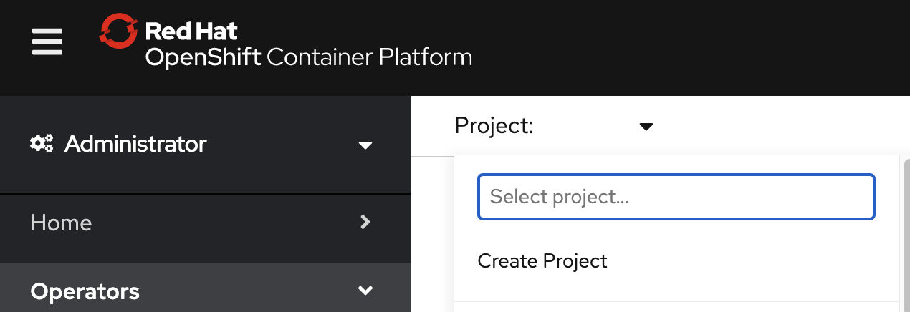

---
#Front matter (metadata).

authors:
 - name: "Rahul Reddy Ravipally"
   email: "raravi86@in.ibm.com"
 - name: "Manoj Jahgirdar"
   email: "manoj.jahgirdar@in.ibm.com"
 - name: "Srikanth Manne"
   email: "srikanth.manne@in.ibm.com"
 - name: "Manjula G. Hosurmath"
   email: "mhosurma@in.ibm.com"

completed_date: "2020-09-29"
last_updated:  "2020-09-29"

draft: true

excerpt: Follow the steps in this tutorial to set up and deploy a CrunchyDB operator hosted on Red Hat Marketplace.
keywords:  "CrunchyDB, CrunchyDB Operator, Red Hat Marketplace"
abstract:  Follow the steps in this tutorial to set up and deploy a CrunchyDB operator hosted on Red Hat Marketplace.

# related_content:        # OPTIONAL - Note: zero or more related content
#  - type: announcements|articles|blogs|patterns|series|tutorials|videos
 #   slug:

related_links:           # OPTIONAL - Note: zero or more related links
  - title: "Crunchy PostgreSQL for Kubernetes"
    url: "https://marketplace.redhat.com/en-us/products/crunchy-postgresql-for-kubernetes"
    # description:
  - title: "Red Hat Marketplace"
    url: "https://marketplace.redhat.com/"
    # description:

title: "Deploy a CrunchyDB Operator from Red Hat Marketplace on an OpenShift cluster"
subtitle: "Follow these steps to deploy a supported CrunchyDB operator to an OpenShift cluster"

primary_tag: databases
tags:
  - databases
  - containers

---
Red Hat® OpenShift® 4 users can access certified software for container-based environments via the [Red Hat Marketplace](https://marketplace.redhat.com/en-us/about). Software in the marketplace is immediately available to deploy on any Red Hat OpenShift cluster in a fast, integrated way. Follow the steps in this tutorial to set up and deploy a CrunchyDB operator hosted on Red Hat Marketplace. <!--EM: What is CrunchDB exactly? Why woudl devs care about it?-->

<!--EM: Are there any tech prereqs we need to mention here? It seems like having an OpenShift 4 license? Or setting up a cluster?-->

## Steps

1. Configure an Openshift cluster with Red Hat Marketplace
1. Install the CrunchyDB Operator
1. Connect to the Openshift Cluster in your command line interface
1. Create and deploy a CrunchyDB Operator on an OpenShift cluster and create a database
1. Access the cluster on your localhost

### Step 1: Configure a Red Hat OpenShift Cluster with Red Hat Marketplace
<!--EM: I think we might need to take this entire section out and create a separate piece that all of our RHM content points to about Configuring an OpenShift Cluster on RHM. I was about to copy my edits from https://developer.ibm.com/tutorials/get-started-using-a-cockroachdb-operator-hosted-on-red-hat-marketplace/ and realized it might be better to just make it separate piece so that we can point to it in every piece of contetn without hurting our SEO (which would happen if we have the same content in the top section of each piece-->.

#### Step 1.1: Download OpenShift Command Line Interface (CLI) binary

- Follow the steps below to launch the cluster console which is also called RedHat OpenShift Container Platform.

- Login to [IBM Cloud Account](https://cloud.ibm.com/) and navigate to Dashboard as shown.


- Click on **Clusters** and select the cluster which you have created under prerequisites. In our case, cluster name is **cp-rhm-poc**.


- After you launch the cluster, click on **OpenShift web console** on the top right hand side.


- We can see the RedHat OpenShift Container Platform (Web Console). Click on **question mark icon** on the top right hand side and select **Command Line Tools**. 


- Navigate to the section `oc - OpenShift Command Line Interface (CLI)` and download the respective oc binary onto your local system. 

**NOTE: This is needed to manage OpenShift projects from a terminal and is further extended to natively support OpenShift Container Platform features.**


- We are all set to proceed to next step which is to register the OpenShift cluster on RedHat Marketplace platform. 

**NOTE: This is mandatory to install any operators from RedHat Marketplace platform using the OpenShift cluster**.

#### Step 1.2: Register the cluster on RedHat Marketplace

- Sign up and login to RHM portal at [Link](https://marketplace.redhat.com/en-us) and click on **workspace** and then click on cluster. We need to add our new OpenShift cluster and register it on RHM platform.


- Update the **cluster name**, generate the pull secret as per the instructions and save it as shown.


- Copy the curl command which starts with `curl -sL https` and append the pull secret towards the end. 

**NOTE: The entire script should be handy to be used in next step.**

- We need to start the cluster first to register it. Open a terminal and type `oc login`, update the `username` and `password` which are used for accessing the cluster and hit enter. 


- The cluster is up and running at this point. We need to run the entire script which is from previous step and hit enter. It will take a couple of mins and we can see that we have successfully registered the cluster on RHM portal.


#### Step 1.3: Create a project in web console

- We need to create a project to be used and managed from command line. Click on **Create Project** and give a name as `Cockroachdb-test-project`.



### Step 2: Install the CrunchyDB Operator

1. Navigate to the **OpenShift web console** which you launched in previous step. Select **OperatorHub** under Operators and type "Crunchy" in the search bar.

    

1. Select **Crunchy Postgres Operator** (non custom) and click **Install**.

    

1. Create an Operator Subscription by choosing All namespaces or specific namespace (select default project crunchy-project) and click **Subscribe**.

    

1. After a few minutes, the operator is installed on the cluster. Verify your installation by selecting **Installed Operators** under `Operators` and make sure the status shows as Succeeded.

    

### Step 3: Connect to the Openshift Cluster in your command line interface

1. Log in to the Red Hat OpenShift on IBM Cloud Kubernetes Service cluster through your CLI. To log in, you need a token which can be genrated after you log into the Openshift Cluster web console. See below screenshot to `copy the path`.<!--EM: What does "copy the path" mean?-->

    

1.  new window will open requesting the login token details. Copy the login token. 
    

1. In your terminal, paste the login token. Once you log in, you should see a screen that has information about your login name, your server, the token, and the projects.

    

### Step 4: Create and deploy a CrunchyDB Operator on an OpenShift Cluster and create a database
<!--EM: In this section, what are `pgo` and pvc`-->

1. Use the new namespace where you installed the Crunchy Postgres operator.

1. Run the following command in your command line interface (CLI). Once it runs successfully, check the logs and be sure there are no errors in the Ansible script. <!--EM: Do they have to have Ansible installed?-->. Wait for the pod state to change to Complete.

    ``oc create -f postgres-operator.yml`` 

    ``oc get po
    NAME               READY   STATUS      RESTARTS   AGE
    pgo-deploy-zl6sz   0/1     Completed   0          24h
    ``

1. Switch to the `pgo` namespace. 

1. Edit `pgo-config configmap` and update `DisableFSGroup` to `false`.

1. Restart PostgreSQL operator pod. postgres-operator-f7d8c5667-4hhrk

    > Note: Why did you have to restart your PostgreSQL pod (steps 4 and 5)? Crunchy PostgreSQL for Kubernetes is set up to work with the "restricted" SCC<!--EM: What is SCC?--> by default, but we may need to make modifications. In this mode, you want to ensure that "DisableFSGroup" is set to **false**. Changing the `pgo-config` ConfigMap requires the `postgres-operator` pod to restart. 

1. Download the pgo binary mentioned in the [document URL](https://access.crunchydata.com/documentation/postgres-operator/latest/quickstart/)

1. Make sure the pvc are in a bound state. Run the following command: `oc get pvc`.

    

1. Create a database using the following command.

    ``pgo create cluster -n pgo hippo``

This will create a database (pods) in the pgo namespace.

1. To validate that it worked correctly, run the following commands.
    
    a. `` pgo show cluster -n pgo hippo``
    b.  ``pgo test -n pgo hippo``
    
    <!--EM: What are those different commands for? Or what do they do when you run them?-->

Attached is the postgres-operator.yml updated file. (edited) 

    [Download postgres-operator.yml](postgres-operator.yml)

### Step 5: Access the cluster on your localhost

T view the results of the commands you ran in the earlier steps via the pgAdmin 4 console<!--EM: What is pgAdmin 4 console? Is that the RH console?-->. Access the console at localhost with port forwarding.

- Run the following command in Terminal:

    ```bash
    $ pgo create pgadmin hippo
    ```
    
    This creates a pgAdmin 4 deployment unique to this PostgreSQL cluster and synchronizes the PostgreSQL user information into it.

1. To access pgAdmin 4, you can set up a `port-forward` to the service, which follows the pattern `<clusterName>-pgadmin`, to port `5050`:

    ```bash
    $ kubectl port-forward -n pgo svc/hippo-pgadmin 5050:5050 
    ```

    ```
    Forwarding from 127.0.0.1:5050 -> 5050
    Forwarding from [::1]:5050 -> 5050
    ```

1. Open <http://localhost:5050> on your browser and use your database username (e.g. `hippo`) and password (e.g. `datalake`) to log in.

     

    **Note**: If your password doesn't work, retry setting up the user with the [pgo update](https://access.crunchydata.com/documentation/postgres-operator/4.3.2/pgo-client/reference/pgo_update_user/) user command: `pgo update user -n pgo --username=hippo --password=datalake hippo`.

Once logged in, you can see the pgAdmin 4 console as shown.

    
