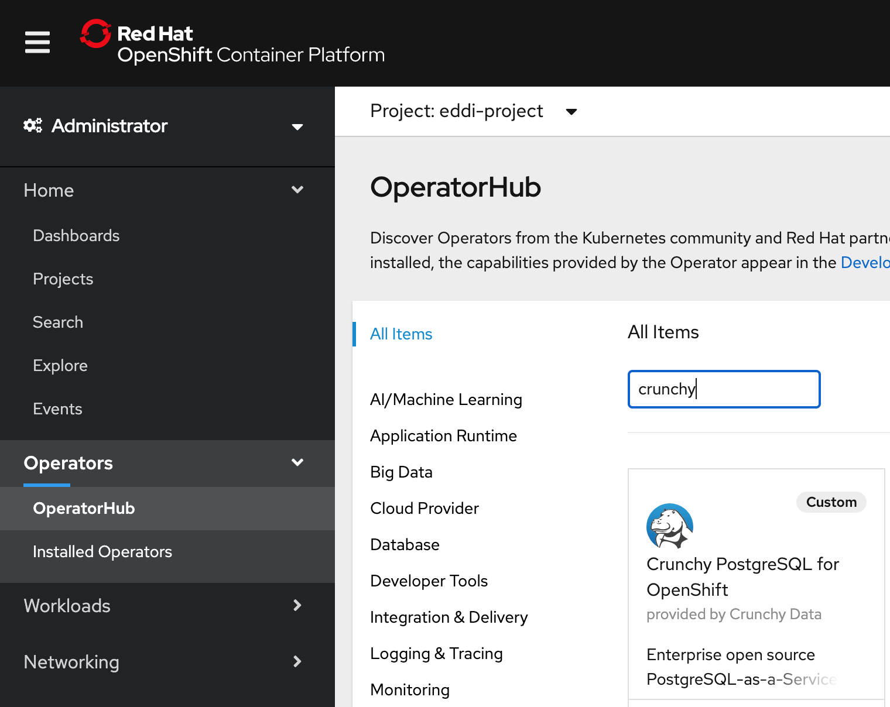

---
#Front matter (metadata).

authors:
 - name: "Rahul Reddy Ravipally"
   email: "raravi86@in.ibm.com"
 - name: "Manoj Jahgirdar"
   email: "manoj.jahgirdar@in.ibm.com"
 - name: "Srikanth Manne"
   email: "srikanth.manne@in.ibm.com"
 - name: "Manjula G. Hosurmath"
   email: "mhosurma@in.ibm.com"

completed_date: "2020-09-29"
last_updated:  "2020-09-29"

draft: true

excerpt: Follow the steps in this tutorial to set up and deploy a CrunchyDB operator hosted on Red Hat Marketplace.
keywords:  "CrunchyDB, CrunchyDB Operator, Red Hat Marketplace"
abstract:  Follow the steps in this tutorial to set up and deploy a CrunchyDB operator hosted on Red Hat Marketplace.

# related_content:        # OPTIONAL - Note: zero or more related content
#  - type: announcements|articles|blogs|patterns|series|tutorials|videos
 #   slug:

related_links:           # OPTIONAL - Note: zero or more related links
  - title: "Crunchy PostgreSQL for Kubernetes"
    url: "https://marketplace.redhat.com/en-us/products/crunchy-postgresql-for-kubernetes"
    # description:
  - title: "Red Hat Marketplace"
    url: "https://marketplace.redhat.com/"
    # description:

title: "Deploy a CrunchyDB Operator from Red Hat Marketplace on an OpenShift cluster"
subtitle: "Follow these steps to deploy a supported CrunchyDB operator to an OpenShift cluster"

primary_tag: databases
tags:
  - databases
  - containers

---
Red Hat® OpenShift® 4 users can access certified software for container-based environments via the [Red Hat Marketplace](https://marketplace.redhat.com/en-us/about). Software in the marketplace is immediately available to deploy on any Red Hat OpenShift cluster in a fast, integrated way. Follow the steps in this tutorial to set up and deploy a CrunchyDB operator hosted on Red Hat Marketplace.

## Prerequisites

* Red Hat OpenShift version 4.3 is required to use with software in Red Hat Marketplace. You can set up a class cluster on IBM Cloud using these instructions: 
[Set up an OpenShift Cluster](https://cloud.ibm.com/docs/openshift?topic=openshift-getting-started).
* [Create an account](https://marketplace.redhat.com/api-security/en-us/login/landing) on Red Hat Marketplace.
* Complete the steps in this tutorial: [Configure a Red Hat OpenShift cluster hosted on Red Hat Marketplace](https://developer.ibm.com/tutorials/configure-a-red-hat-openshift-cluster-with-red-hat-marketplace)

## Steps

1. Install the CrunchyDB Operator
1. Create and deploy a CrunchyDB Operator on an OpenShift cluster and create a database
1. Access the cluster on your localhost

### Step 1: Install the CrunchyDB Operator

1. Navigate to your **OpenShift web console**. Select **OperatorHub** under Operators and type "Crunchy" in the search bar.

    

1. Select **Crunchy Postgres Operator** (non custom) and click **Install**.

    

1. Create an Operator Subscription by choosing All namespaces or specific namespace (select default project crunchy-project) and click **Subscribe**.

    

1. After a few minutes, the operator is installed on the cluster. Verify your installation by selecting **Installed Operators** under `Operators` and make sure the status shows as Succeeded.

    

### Step 2: Create and deploy a CrunchyDB Operator on an OpenShift Cluster and create a database

1. Use the new namespace where you installed the Crunchy Postgres operator.

1. Run the following command in your command line interface (CLI). Once it runs successfully, check the logs and be sure there are no errors in the Ansible script. <!--EM: Do they have to have Ansible installed?-->. Wait for the pod state to change to Complete.

    ```oc create -f postgres-operator.yml``` 

    ```oc get po
    NAME               READY   STATUS      RESTARTS   AGE
    pgo-deploy-zl6sz   0/1     Completed   0          24h
    ```

1. Switch to the `pgo` namespace. `pgo` is a library used to connect to the OpenShift cluster.

1. Edit `pgo-config configmap` and update `DisableFSGroup` to `false`.

1. Restart the PostgreSQL operator pod, postgres-operator-f7d8c5667-4hhrk

    > Note: Why did you have to restart your PostgreSQL pod (steps 4 and 5)? Crunchy PostgreSQL for Kubernetes is set up to work with the "restricted" SCC<!--EM: What is SCC?--> by default, but we may need to make modifications. In this mode, you want to ensure that "DisableFSGroup" is set to **false**. Changing the `pgo-config` ConfigMap requires the `postgres-operator` pod to restart. 


1. Download the pgo binary mentioned in the [document URL](https://access.crunchydata.com/documentation/postgres-operator/latest/quickstart/).

    We need to create a project to be used and managed from command line. Click on **Create Project** and give a name as `Crunchydb-test-project`.


1. Make sure the pvc are in a bound state. Run the following command: `oc get pvc`.

    

1. Create a database using the following command.

    ``pgo create cluster -n pgo hippo``

This will create a database (pods) in the pgo namespace.

1. To validate that it worked correctly, run the following commands.
    
    To validate the cluster: ` pgo show cluster -n pgo hippo`
    
    To validate the test: `pgo test -n pgo hippo`

Attached is the postgres-operator.yml updated file. (edited) 

    [Download postgres-operator.yml](postgres-operator.yml)

### Step 3: Access the cluster on your localhost

To view the results of the commands you ran in the earlier steps via the pgAdmin 4 console<!--EM: What is pgAdmin 4 console? Is that the RH console?-->. Access the console at localhost with port forwarding.

1. Run the following command in your terminal:

    ```bash
    $ pgo create pgadmin hippo
    ```
    
    This creates a pgAdmin 4 deployment unique to this PostgreSQL cluster and synchronizes the PostgreSQL user information into it.

1. To access pgAdmin 4, you can set up a `port-forward` to the service, which follows the pattern `<clusterName>-pgadmin`, to port `5050`:

    ```bash
    $ kubectl port-forward -n pgo svc/hippo-pgadmin 5050:5050 
    ```

    ```
    Forwarding from 127.0.0.1:5050 -> 5050
    Forwarding from [::1]:5050 -> 5050
    ```

1. Open <http://localhost:5050> on your browser and use your database username (e.g. `hippo`) and password (e.g. `datalake`) to log in.

     

    **Note**: If your password doesn't work, retry setting up the user with the [pgo update](https://access.crunchydata.com/documentation/postgres-operator/4.3.2/pgo-client/reference/pgo_update_user/) user command: `pgo update user -n pgo --username=hippo --password=datalake hippo`.

Once logged in, you can see the pgAdmin 4 console as shown.

    
